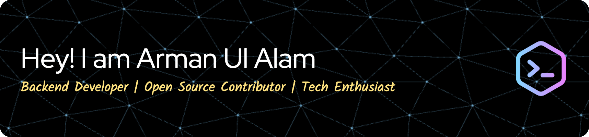

# Hi 👋, I'm Arman Ul Alam
A passionate **Backend Developer** | **Open Source Contributor** | **Tech Enthusiast**
> *"Building the future with code."*

---

## 👨‍💻 About Me
Hi there! I'm **Arman Ul Alam**, a passionate backend developer and open-source enthusiast. My mission is to create scalable solutions, contribute to impactful open-source projects, and explore cutting-edge technologies.

- 🌱 Currently learning: **Large Language Models (LLMs)**, **Transformer Architectures**, **Generative AI**  
- 💬 Let's chat about **Natural Language Processing (NLP)**, **Machine Learning Pipelines**, or **AI Deployment**  
- 🚀 Future goals: Build and publish an end-to-end SaaS platform  
- ⚡ Fun fact: I solve algorithm challenges for fun and contribute to open-source projects regularly!  
<!-- - 📫 How to reach me: [email@example.com](mailto:email@example.com) -->

---

## 🛠️ Languages and Tools:
### **Programming Languages:**

### **AI/ML Frameworks:**

### **Web Development:**

### **Data Science & Utilities:**

### **DevOps Tools:**

---

## 📈 GitHub Stats:
<table>
  <tr>
    <td>
      
    </td>
    <td>
      
    </td>
  </tr>
</table>

  

---

## 📈 Contribution Graph:

---

## 🚀 Featured Projects:
- [**Portfolio Website**](https://armanulalam.dev) - A personal portfolio to showcase my projects and skills.
<!-- - [**Open Source Contribution**](https://github.com/some-repo) - Contributed to XYZ features and bug fixes.
- [**E-Commerce App**](https://github.com/yourusername/ecommerce-app) - A MERN stack e-commerce platform. -->

---
<!--
## 📝 Testimonials or Quotes
> "Arman is a talented backend developer who brings immense value to every project!" — *John Doe, Team Lead at XYZ*  

> "His problem-solving skills and collaborative spirit are unmatched. A pleasure to work with!" — *Jane Smith, Senior Developer at ABC*  

> "Arman's contributions to our open-source project helped us meet critical deadlines. Highly recommend him!" — *Sarah Johnson, Open Source Contributor*  

--- 

## 📚 Certifications and Badges

  
  
  
  

---
-->

## 🎵 Now Playing:
> Here's what I'm vibing to while I code:  

---

## ✍️ Recent Blog Posts:
- [Generative AI for Beginners](https://medium.com/@armaan.swe/generative-ai-for-beginners-unlocking-the-power-of-creativity-in-machines-f5e7f7512150)
- [Understanding List Operations in Python](https://medium.com/@armaan.swe/understanding-list-operations-in-python-the-difference-between-and-26bc2004c0)  

> Stay tuned for more updates!  

---

## 🏆 Achievements:

---

## 🌐 Connect with Me:

<!-- 
 -->

---

## 📥 Visitor Count:

---
<!--
## ⚙️ Automate Updates:
Use [GitHub Actions](https://github.com/features/actions) to automate sections like "Now Playing" on Spotify, blog posts, or contribution graphs.

---
-->

*Feel free to connect for collaborations, open-source projects, or just a tech chat!*  
